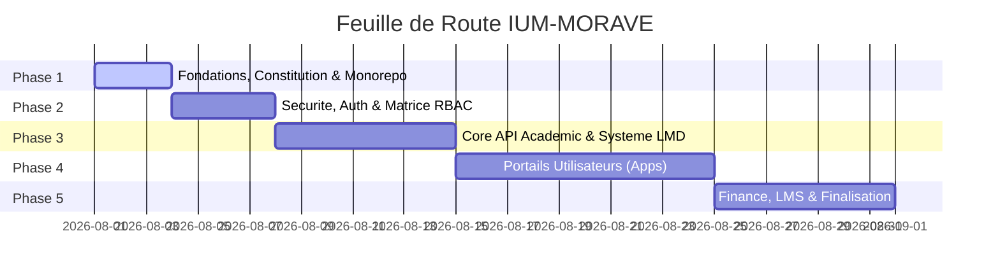

# 📋 MASTER TODO & PROJECT TRACKER — IUM-MORAVE

> **STATUT GLOBAL DU CHANTIER** : 🚀 Phase 1 — Fondations & Structure Monorepo  
> **Dernière mise à jour** : 01 Août 2026

---

## 📊 VUE D'ENSEMBLE DES PHASES

---

## 🛠️ SUIVI DÉTAILLÉ DES PHASES

### PHASE 1 : FONDATIONS & STRUCTURATION MONOREPO
- [x] **Liaison GitHub** : Connecter le dossier local au dépôt GitHub `Adolphechris/IUM-MORAVE`.
- [x] **Gouvernance** : Rédiger et promulguer la [CONSTITUTION.md](file:///home/adolphe/IUM-MORAVE/CONSTITUTION.md).
- [x] **Master Tracker** : Mettre en place le fichier [TODO.md](file:///home/adolphe/IUM-MORAVE/TODO.md).
- [ ] **Architecture Dossier** : Créer l'arborescence physique Monorepo (`apps/`, `services/`, `shared/`, `docs/`).
- [ ] **Documentation globale** : Mettre à jour le [README.md](file:///home/adolphe/IUM-MORAVE/README.md) avec le plan complet.

---

### PHASE 2 : AUTHENTIFICATION, SÉCURITÉ & ROLES (RBAC)
- [ ] **Spécification du Modèle Utilisateur** : Définir le schéma complet (Étudiants, Enseignants, Admin, Finance).
- [ ] **Module `services/auth-service`** :
  - [ ] Gestion des identifiants & réinitialisation sécurisée.
  - [ ] Génération & validation de tokens JWT sécurisés avec rôles.
  - [ ] Middleware de contrôle d'accès (RBAC).

---

### PHASE 3 : CORE ACADÉMIQUE & SYSTÈME LMD (LICENCE - MASTER - DOCTORAT)
- [ ] **Modélisation de la Scolarité** :
  - [ ] Universités / Facultés / Départements.
  - [ ] Offres de formation, Unités d'Enseignement (UE) et ECUE.
  - [ ] Attribution des crédits ECTS / LMD.
- [ ] **Module `services/core-api`** :
  - [ ] CRUD Filières & Unités d'Enseignement.
  - [ ] Gestion des dossiers étudiants & matricules.
  - [ ] Moteur de saisie des notes et calcul des moyennes ponderées (GPA).
  - [ ] Générateur de procès-verbaux de délibération & relevés de notes.

---

### PHASE 4 : PORTAILS & ESPACES UTILISATEURS (FRONTEND INTERFACES)
- [ ] **Module `shared/`** : Design System, thèmes CSS, composants communs UI (Tableaux, Modales, Badges, Header).
- [ ] **App `apps/web-portal`** : Portail public d'information, admissions et présentation de l'IUM-MORAVE.
- [ ] **App `apps/student-space`** :
  - [ ] Dashboard personnalisé de l'étudiant.
  - [ ] Consultation des notes, moyenne générale et validation des UE.
  - [ ] Telechargement des relevés de notes & certificats de scolarité.
  - [ ] Consultation de l'emploi du temps et calendrier académique.
- [ ] **App `apps/teacher-space`** :
  - [ ] Dashboard Enseignant.
  - [ ] Interface de saisie rapide et sécurisée des notes.
  - [ ] Dépôt des supports de cours & gestion des absences.
- [ ] **App `apps/admin-dashboard`** :
  - [ ] Vue 360° Scolarité (Inscriptions, Statistiques, Effectifs).
  - [ ] Validation des délibérations et clôture des semestres.
  - [ ] Audit & Journal des actions système.

---

### PHASE 5 : COMPTABILITÉ, LMS & DÉPLOIEMENT
- [ ] **Module `services/finance-service`** :
  - [ ] Suivi du plan de règlement des frais de scolarité.
  - [ ] Génération automatique de reçus & quittances de paiement.
  - [ ] Blocage/Déblocage automatique des accès aux relevés selon le statut financier.
- [ ] **Système de Notification** : Alerte email/SMS pour les absences, notes publiées, et relances financières.
- [ ] **Intégration & Tests Globaux** : Validation de bout en bout et déploiement.

---

## 📌 NORMES TECHNIQUE ET JOURNAL DES COMMITS
| Date | Action | Auteur | Statut |
| :--- | :--- | :--- | :--- |
| 2026-08-01 | Initialisation du projet et liaison GitHub | Antigravity | ✅ Terminé |
| 2026-08-01 | Rédaction de la Constitution (`CONSTITUTION.md`) | Antigravity | ✅ Terminé |
| 2026-08-01 | Création du Tracker Master (`TODO.md`) | Antigravity | ✅ Terminé |
