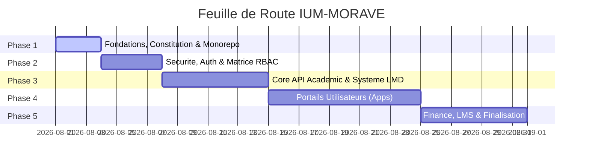

# 📋 MASTER TODO & PROJECT TRACKER — IUM-MORAVE

> **STATUT GLOBAL DU CHANTIER** : 🚀 Phase 3 en cours | Services opérationnels & Espaces métiers squelettés
> **Dernière mise à jour** : 01 Août 2026
> **Prochaines actions** : finaliser les espaces métiers, intégrer le design system partagé, préparer le module finance et le déploiement.

---

## 📊 VUE D'ENSEMBLE DES PHASES

---

## 🛠️ SUIVI DÉTAILLÉ DES PHASES

### PHASE 1 : FONDATIONS & STRUCTURATION MONOREPO
- [x] **Liaison GitHub** : Connecter le dossier local au dépôt GitHub `Adolphechris/IUM-MORAVE`.
- [x] **Gouvernance** : Rédiger et promulguer la [CONSTITUTION.md](file:///home/adolphe/IUM-MORAVE/CONSTITUTION.md).
- [x] **Master Tracker** : Mettre en place le fichier [TODO.md](file:///home/adolphe/IUM-MORAVE/TODO.md).
- [x] **Migration CI** : Réparer le workflow `run-migrations` et valider les checks `run-migrations` + `run-migrations-safe`.
- [ ] **Confirmation Supabase** : Vérifier que le schéma et les seeds sont bien appliqués sur Supabase.
- [ ] **Build CI** : Attendre le résultat du check `build` avant fusionner.
- [ ] **Architecture Dossier** : Créer l'arborescence physique Monorepo (`apps/`, `services/`, `shared/`, `docs/`).
- [ ] **Documentation globale** : Mettre à jour le [README.md](file:///home/adolphe/IUM-MORAVE/README.md) avec le plan complet.

---

### SPRINT 0 : PREPARATION ET VERIFICATION
- [x] Vérifier et corriger la liaison GitHub + PR.
- [x] Réparer le workflow de migration Supabase (`run-migrations`).
- [x] Valider `run-migrations` et `run-migrations-safe` sur CI.
- [ ] Confirmer l’application du schéma Supabase dans le dashboard ou via un runner IPv6.
- [ ] Finaliser l’état de la base de données avant le développement fonctionnel.
- [x] Créer les premières issues GitHub pour les epics prioritaires.
- [x] Créer le plan de sprint et la documentation de suivi (`docs/SPRINT_PLAN.md`).

#### Backlog initial GitHub
- Issue #179 — Infra & base de données: valider l’accès Supabase et définir le schéma initial
- Issue #180 — Architecture monorepo: créer l’arborescence apps/services/shared/docs
- Issue #181 — Authentification & RBAC: définir le modèle utilisateur et le premier flux d’auth
- Issue #182 — API académique core: définir les entités de base facultés/programmes/parcours
- Issue #183 — Système mail professionnel: notifications et communication officielle
- Issue #184 — Générateur sécurisé de relevés de notes conforme aux normes congolaises

### SPRINT 1 : DEMARRAGE DU DEVELOPPEMENT
- [x] Définir l’architecture Monorepo et créer l’arborescence `apps/`, `services/`, `shared/`, `docs/`.
- [x] Spécifier le modèle utilisateur et la sécurité d’accès initiale.
- [x] Construire le module `services/auth-service` pour auth et RBAC.
- [x] Préparer le socle API core pour les données académiques.
- [x] Documenter les conventions de service et les endpoints initiaux.

### SPRINT 2 : MVP PUBLIC ET ESPACE UTILISATEUR
- [x] Développer le portail public basique (`apps/web`) avec pages institutionnelles.
- [x] Créer l’espace utilisateur étudiant/enseignant minimal.
- [x] Mettre en place les premières pages de consultation de programmes, facultés et actualités.
- [x] Connecter les premiers flux frontaux au backend API core.
- [x] Ajouter un système de courriel professionnel avec aperçu de développement.
- [x] Concevoir le générateur sécurisé de relevés de notes ; validation institutionnelle requise avant production.

### SPRINT 3 : MODULES ACADÉMIQUES & ADMINISTRATION
- [x] Implémenter la gestion MVP des facultés, des programmes et des parcours.
- [x] Ajouter les opérations MVP de gestion des inscriptions et des délibérations.
- [x] Construire les premières fonctions d’administration, d'audit et de reporting.
- [x] Préparer le workflow MVP de notes et documents académiques.
- [x] Garantir l’intégrité cryptographique des relevés MVP et la vérification publique.
- [ ] Connecter les données MVP à Supabase avant tout usage réel.

### IDENTITE ACADEMIQUE ET MEDIAS
- [x] Renommer la faculté informatique en « Faculté des Sciences Informatiques et Nouvelles Technologies ».
- [x] Retirer le programme « Master Intelligence Artificielle ».
- [x] Ajouter des spécialités par filière dans le catalogue MVP.
- [x] Prévoir un emplacement pour le logo officiel et onze emplacements photo dans le portail.
- [ ] Recevoir, optimiser et publier le logo officiel et les onze photos institutionnelles validées.

### LOT LIVRÉ : PORTAIL PUBLIC DÉTAILLÉ
- [x] Ajouter les pages détaillées pour facultés, formations et actualités.
- [x] Ajouter la recherche de documents publics.
- [x] Ajouter le formulaire de contact public avec validation, champ piège et limite de cinq demandes par heure et par IP.
- [ ] Rendre persistants les demandes de contact et les documents avec Supabase avant toute ouverture réelle.

---

### PHASE 2 : AUTHENTIFICATION, SÉCURITÉ & ROLES (RBAC)
- [ ] **Spécification du Modèle Utilisateur** : Définir le schéma complet (Étudiants, Enseignants, Admin, Finance).
- [ ] **Module `services/auth-service`** :
  - [ ] Gestion des identifiants & réinitialisation sécurisée.
  - [ ] Génération & validation de tokens JWT sécurisés avec rôles.
  - [ ] Middleware de contrôle d'accès (RBAC).

---

### PHASE 3 : CORE ACADÉMIQUE & SYSTÈME LMD (LICENCE - MASTER - DOCTORAT)
- [ ] **Modélisation de la Scolarité** :
  - [ ] Universités / Facultés / Départements.
  - [ ] Offres de formation, Unités d'Enseignement (UE) et ECUE.
  - [ ] Attribution des crédits ECTS / LMD.
- [ ] **Module `services/core-api`** :
  - [ ] CRUD Filières & Unités d'Enseignement.
  - [ ] Gestion des dossiers étudiants & matricules.
  - [ ] Moteur de saisie des notes et calcul des moyennes ponderées (GPA).
  - [ ] Générateur de procès-verbaux de délibération & relevés de notes.

---

### PHASE 4 : PORTAILS & ESPACES UTILISATEURS (FRONTEND INTERFACES)
- [x] **Module `shared/`** : Design System, composants communs UI (Header, Footer, Card, Input, Badge, Container, Alert, Layout).
- [x] **App `apps/web`** : Portail public MVP, pages détaillées et formulaire de contact.
- [x] **App `apps/student-space`** : login, relevé de notes, notes détaillées, emploi du temps.
- [x] **App `apps/teacher-space`** : login, cours, notes saisies.
- [x] **App `apps/admin-dashboard`** : login, tableau de bord, audit logs, inscriptions.
- [ ] **Apps métiers** : Finaliser les pages de saisie des notes, upload documents, délibérations et gestion financière.
- [ ] **Persistance Supabase** : Connecter les services et les apps à Supabase avant déploiement.

#### LOT ACTIF : ESPACES METIERS ET ADMINISTRATION
- [x] API initiale des profils étudiant, enseignant, cours, calendrier et documents.
- [x] Tableau de bord administratif initial avec indicateurs et échéances.
- [x] Provisionnement initial de comptes par un administrateur.
- [x] Pages dédiées complètes pour étudiant, enseignant et administration.
- [ ] Stockage documentaire et contrôle d'accès durable.

---

### PHASE 5 : COMPTABILITÉ, LMS & DÉPLOIEMENT
- [ ] **Module `services/finance-service`** :
  - [ ] Suivi du plan de règlement des frais de scolarité.
  - [ ] Génération automatique de reçus & quittances de paiement.
  - [ ] Blocage/Déblocage automatique des accès aux relevés selon le statut financier.
- [ ] **Système de Notification** : Alerte email/SMS pour les absences, notes publiées, et relances financières.
- [ ] **Intégration & Tests Globaux** : Validation de bout en bout et déploiement.

---

## 📌 NORMES TECHNIQUE ET JOURNAL DES COMMITS
| Date | Action | Auteur | Statut |
| :--- | :--- | :--- | :--- |
| 2026-08-01 | Initialisation du projet et liaison GitHub | Antigravity | ✅ Terminé |
| 2026-08-01 | Rédaction de la Constitution (`CONSTITUTION.md`) | Antigravity | ✅ Terminé |
| 2026-08-01 | Création du Tracker Master (`TODO.md`) | Antigravity | ✅ Terminé |
| 2026-08-01 | Correction du workflow de migration et validation des checks `run-migrations` + `run-migrations-safe` | Copilot | ✅ Terminé |
| 2026-08-01 | Fusion de la branche de développement avancée dans `main` | Kilo | ✅ Terminé |
| 2026-08-01 | Nettoyage de la duplication `apps/api`, mise à jour de la CI et ajout des espaces métiers | Kilo | ✅ Terminé |
| 2026-08-01 | Ajout du design system partagé et des squelettes d'apps `student-space`, `teacher-space`, `admin-dashboard` | Kilo | ✅ Terminé |
| 2026-08-01 | Intégration des composants `Header` et `Footer` partagés dans toutes les apps | Kilo | ✅ Terminé |
| 2026-08-01 | Ajout des endpoints métiers complémentaires (grades, enrollments, documents, users) et intégration dans les espaces | Kilo | ✅ Terminé |
