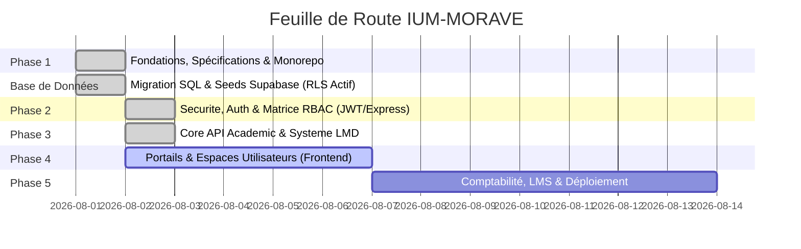

# 📋 MASTER TODO & PROJECT TRACKER — IUM-MORAVE

> **STATUT GLOBAL DU CHANTIER** : 🚀 Phase 1-3 Terminées ✅ | Phase 4 en cours | PR #186 CI verte, en attente de review
> **Dernière mise à jour** : 2026-08-02 10:35
> **Progression globale estimée** : 90%
> **Objectif immédiat** : Obtenir review PR #186, finaliser UX apps métiers, préparer Phase 5

---

## 📊 VUE D'ENSEMBLE DES PHASES

---

## 🛠️ SUIVI DÉTAILLÉ DES PHASES

### PHASE 1 : FONDATIONS & STRUCTURATION MONOREPO
- [x] **Liaison GitHub** : Connecter le dossier local au dépôt GitHub `Adolphechris/IUM-MORAVE`.
- [x] **Gouvernance** : Rédiger et promulguer la [CONSTITUTION.md](file:///home/adolphe/IUM-MORAVE/CONSTITUTION.md).
- [x] **Spécifications & Architecture** : Cahier des charges (4200+ l.), Modèle de données LMD, OpenAPI spec.
- [x] **Audit & Fusion** : Fusion de la branche de développement dans `main` (63 fichiers / +7600 lignes).
- [x] **Base de Données Cloud** : Migrations SQL et Seeds déployés sur Supabase avec RLS actif.
- [x] **Master Tracker** : Mettre en place le fichier [TODO.md](file:///home/adolphe/IUM-MORAVE/TODO.md).

---

### PHASE 2 : AUTHENTIFICATION, SÉCURITÉ & ROLES (RBAC) ✅
- [x] **Spécification du Modèle Utilisateur** : Définir le schéma complet (Étudiants, Enseignants, Admin, Finance).
- [x] **Module `services/auth-service`** :
  - [x] Gestion des identifiants & réinitialisation sécurisée (forgot/reset password).
  - [x] Génération & validation de tokens JWT sécurisés avec rôles.
  - [x] Middleware de contrôle d'accès (RBAC) — `authenticate` + `requireRole`.
  - [x] **Refresh tokens** (7 jours) avec endpoint `/auth/refresh`.
  - [x] **Vérification email** avec endpoints `/auth/verify-email/request` et `/auth/verify-email/confirm`.
  - [x] **Token blacklist** (logout révoque le token).
  - [x] **Rate limiting** (5 login/min, 3 register/h, 3 forgot/h).
  - [x] **6 tests automatisés** couvrant register, login, logout, reset, RBAC.

---

### PHASE 3 : CORE ACADÉMIQUE & SYSTÈME LMD (LICENCE - MASTER - DOCTORAT) ✅
- [x] **Modélisation de la Scolarité** :
  - [x] Universités / Facultés / Départements.
  - [x] Offres de formation, Unités d'Enseignement (UE) et ECUE.
  - [x] Attribution des crédits ECTS / LMD.
- [x] **Module `services/core-api`** :
  - [x] CRUD Filières & Unités d'Enseignement (faculties, programs, tracks, courses).
  - [x] Gestion des dossiers étudiants & matricules (enrollments).
  - [x] Moteur de saisie des notes et calcul des moyennes pondérées (GPA).
  - [x] **Moteur LMD** (`lmd-engine.js`) :
    - [x] Calcul moyenne pondérée par UE et globale.
    - [x] Règles de compensation entre UE (moyenne >= 10 pour validation).
    - [x] Règles de rachat (note >= 8 pour éligibilité).
    - [x] Notes éliminatoires (< 8/20 non compensables).
    - [x] Mentions académiques (Très Bien, Bien, Assez Bien, Passable, Rachat, Ajourné).
  - [x] **Générateur de PV de délibération** (`/enrollments/:id/pv`).
  - [x] **Évaluation pré-délibération** (`/enrollments/:id/evaluation`).
  - [x] **Génération de diplômes** (`/enrollments/:id/diploma`) après délibération validée.
  - [x] **Vérification de diplômes** (`/verification/diploma`) par numéro ou QR code.
  - [x] Générateur de relevés de notes signés (HMAC-SHA-256).
  - [x] **20 tests automatisés** couvrant API académique, LMD, PV, diplômes, RBAC.

---

### PHASE 4 : PORTAILS & ESPACES UTILISATEURS (FRONTEND INTERFACES) 🔄
- [x] **Module `shared/`** : Design System, composants communs UI (Button, Card, Header, Footer, Layout, Table, Input, Select, Badge, Alert, Tabs, Container).
- [x] **App `apps/web`** : Portail public (accueil, facultés, formations, actualités, contact, documents, espace).
- [x] **App `apps/student-space`** :
  - [x] Dashboard personnalisé de l'étudiant (login sécurisé).
  - [x] Consultation des notes, moyenne générale et crédits.
  - [x] Consultation de l'emploi du temps.
  - [x] Consultation des documents.
  - [x] Relevé de notes numérique signé.
  - [x] Stockage token JWT + refresh token côté frontend.
  - [x] Restauration session au-refresh.
  - [x] Bouton déconnexion (logout).
- [x] **App `apps/teacher-space`** :
  - [x] Dashboard Enseignant (login sécurisé).
  - [x] Liste des cours attribués.
  - [x] Consultation des notes saisies.
  - [x] Stockage token JWT + refresh token, restauration session, logout.
- [x] **App `apps/admin-dashboard`** :
  - [x] Vue 360° Scolarité (dashboard avec statistiques).
  - [x] Tableau de bord avec onglets (dashboard, audit, inscriptions, documents, utilisateurs, délibérations).
  - [x] Journal d'audit.
  - [x] Stockage token JWT + refresh token, restauration session, logout.
- [x] **CI fixes** : Local Header/Footer comps for apps/web, turbopack.root config, shared import paths, TS syntax corrections.
- [ ] **Améliorations UX/UI** : glassmorphism, micro-animations, responsive mobile.
- [ ] **Tests e2e frontend** : scénarios login → navigation → logout.

---

### PHASE 5 : COMPTABILITÉ, LMS & DÉPLOIEMENT
- [x] **Module `services/finance-service`** :
  - [x] Suivi du plan de règlement des frais de scolarité (`/payment-plans`).
  - [x] Génération automatique de reçus & quittances de paiement (`/payments`, `/receipts/:id`).
  - [x] Blocage/Déblocage automatique des accès aux relevés selon le statut financier (`/student-status/:id`).
- [x] **Système de Notification** (`services/notification-service`) :
  - [x] Templates d'email/SMS pour notifications académiques (grades, absences, relances).
  - [x] Envoi ciblé et groupé de notifications.
  - [x] Historique des notifications envoyées.
- [ ] **Persistance Supabase** : Remplacer les données en mémoire par Supabase.
- [ ] **Tests e2e** : Validation de bout en bout du flux complet.
- [ ] **Déploiement** : Configuration pour déploiement en production.

---

## 📌 NORMES TECHNIQUE ET JOURNAL DES COMMITS
| Date | Action | Auteur | Statut |
| :--- | :--- | :--- | :--- |
| 2026-08-01 | Initialisation du projet et liaison GitHub | Antigravity | ✅ Terminé |
| 2026-08-01 | Rédaction de la Constitution (`CONSTITUTION.md`) | Antigravity | ✅ Terminé |
| 2026-08-01 | Création du Tracker Master (`TODO.md`) | Antigravity | ✅ Terminé |
| 2026-08-01 | Migrations SQL et Seeds Supabase | Antigravity | ✅ Terminé |
| 2026-08-01 | Sprints 0-3 : MVP technique (auth, API, portail) | Antigravity | ✅ Terminé |
| 2026-08-02 | Correction bugs auth-service (bcrypt, reset token) | Cline | ✅ Terminé |
| 2026-08-02 | Ajout refresh tokens + email verification | Cline | ✅ Terminé |
| 2026-08-02 | Moteur LMD (compensation UE, rachat, mentions) | Cline | ✅ Terminé |
| 2026-08-02 | Générateur PV de délibération + diplômes | Cline | ✅ Terminé |
| 2026-08-02 | 26 tests automatisés (6 auth + 20 core-api) | Cline | ✅ Terminé |
| 2026-08-02 | CI verte PR #186 + fixes builds frontend | Kilo | ✅ Terminé |
| 2026-08-02 | Logout, refresh token storage, session restore apps métiers | Kilo | ✅ Terminé |
| 2026-08-02 | Phase 5: finance-service MVP (payment plans, receipts, status) | Kilo | ✅ Terminé |
| 2026-08-02 | Phase 5: notification-service (email/SMS templates, bulk send) | Kilo | ✅ Terminé |